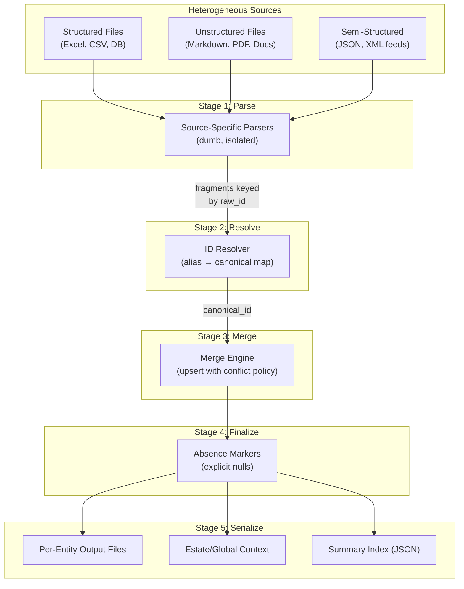

# Multi-Source Entity Consolidation Pattern

> **Purpose**: A reusable architectural pattern for consolidating heterogeneous structured and unstructured data sources into per-entity "dossier" records, ready for LLM insight generation, analytics, or downstream systems.

> **Origin**: Extracted and generalized from the AML Transaction-Monitoring Model Inventory pipeline (`rag_ai_assistant/Structured_data_processing/`).

---

## 1. The Problem (Domain-Agnostic)

You have **N source files** of mixed format — spreadsheets, databases, markdown, PDFs, JSON feeds — that all describe the **same set of entities** along different axes. No single file is complete; each contributes a *fragment* of the full picture.

**You need to**:
1. Parse each source into a normalized fragment keyed by entity ID
2. Resolve inconsistent entity identifiers across sources
3. Merge all fragments into one consolidated record per entity
4. Serialize the merged record for downstream consumption

The core insight: **the real problem is entity resolution + merge, not parsing.** Once each entity's information is consolidated into a single clean record, any downstream step (LLM call, report, dashboard, API) is trivial.

```
sources → per-source parser → normalized fragments (keyed by entity_id)
       → merge/upsert into EntityDossier → serialize → output (one per entity)
```

---

## 2. Architecture Overview



---

## 3. The Five Load-Bearing Decisions

These are where the pipeline breaks if neglected — not in the parsing.

### 3.1 Canonical ID Resolution

> The same entity will appear as `Model_A`, `model a`, `MA-001`, `Model-A (v2)` across different files.

**Pattern**:
- Build an **alias → canonical ID map** up front from a single authoritative source (a summary table, a master list, a registry)
- Every parser passes raw IDs through the resolver before merging
- **Fail loudly** on unmapped IDs — never silently drop data

**Implementation skeleton**:
```python
class IDResolver:
    def __init__(self):
        self._registry: dict[str, dict] = {}    # canonical → metadata
        self._alias_map: dict[str, str] = {}     # lowercase alias → canonical

    def build_from_authority(self, source):
        """Parse the authoritative source and register all entities + aliases."""
        ...

    def resolve(self, raw_id: str) -> str:
        """Map any raw reference to the canonical form. Raise on failure."""
        normalized = self._normalize(raw_id)
        if normalized in self._registry:
            return normalized
        if raw_id.lower() in self._alias_map:
            return self._alias_map[raw_id.lower()]
        raise IDResolutionError(f"Cannot resolve '{raw_id}'")

    def _normalize(self, raw: str) -> str:
        """Strip whitespace, underscores, leading zeros, etc."""
        ...
```

> [!IMPORTANT]
> The ID resolver is the single point of truth. If it's wrong, every merge is wrong. Invest the most testing effort here.

### 3.2 Provenance Tracking

Every datum must carry its source file (and sheet/section/page). This enables:
- **Traceability**: critical in regulated domains (AML, clinical, finance)
- **Debugging**: when output looks wrong, trace it to the input
- **LLM grounding**: prevents the model from attributing a number to the wrong document

**Implementation**: Embed provenance in the data model itself:
```python
@dataclass
class Metric:
    name: str
    value: Any
    source: str  # e.g. "Performance_Report.xlsx/Sheet1"
```

### 3.3 Structured/Prose Separation

> **Inviolable rule: structured stays structured, prose stays prose.**

- Numeric/tabular data → typed fields (`Metric` objects, dicts, typed columns)
- Requirements, design docs, change requests → verbatim text, never parsed into fields

The whole reason an LLM is in the loop is that it ingests prose directly. Parsing prose into fields destroys exactly the nuance the downstream step needs.

### 3.4 Explicit Absence Markers

When an entity has KPIs but no design section, write an explicit `<not provided>` marker. **Silent omission invites hallucination; an explicit null suppresses it.**

```python
@dataclass
class EntityDossier:
    entity_id: str
    metrics: list[Metric] = field(default_factory=list)
    description: str = "<not provided>"  # explicit default
    change_history: list = field(default_factory=list)
```

### 3.5 Conflict Resolution Policy

When two files disagree on the same metric for the same entity, the resolution rule is decided **before merge**, never delegated to downstream consumers.

| Policy | When to Use |
|--------|-------------|
| `keep_both_with_provenance` | Audit/governance contexts where nothing should be discarded |
| `latest_source_wins` | When sources have clear temporal ordering |
| `flag_for_review` | When human review is required for discrepancies |
| `highest_confidence_wins` | When sources have reliability scores |

---

## 4. Implementation Playbook

### Step 1: Define the Entity and Dossier Model

Design the **merge target** — the data class that holds everything about one entity.

```python
@dataclass
class EntityDossier:
    entity_id: str
    entity_code: str = ""

    # Structured metrics grouped by domain/category
    domain_a_metrics: list[Metric] = field(default_factory=list)
    domain_b_metrics: list[Metric] = field(default_factory=list)

    # Unstructured prose (verbatim — never parsed into fields)
    description: str = "<not provided>"
    change_history: list[ChangeRecord] = field(default_factory=list)

    # Cross-entity / estate-wide context attached to this entity
    global_context: str = "<not provided>"
```

### Step 2: Build Source-Specific Parsers

Each parser is **dumb and isolated** — it only knows about one source format. It produces fragments keyed by raw entity ID.

| Source Type | Parser Strategy |
|-------------|----------------|
| **Excel/CSV** (wide layout) | Reshape to long-form `(entity_id, metric_name, value, source)`. Long form is the only shape that merges cleanly when files carry disjoint metric sets. |
| **Excel/CSV** (long layout) | Already in the right shape — just normalize column names |
| **Markdown** (one file, per-entity sections) | Split on heading pattern → map each section to entity_id verbatim |
| **Markdown** (one file per entity) | Entity key from filename or front-matter |
| **PDF** | Pre-parse to markdown (docling, marker, etc.), then apply markdown parser |
| **JSON/XML feeds** | Extract entity ID field, normalize to fragment dict |
| **Database tables** | SQL query → fragment dicts, one per entity |

**Key principle**: Parsers output `dict[raw_entity_id, list[Fragment]]`. They never resolve IDs — that's the merge engine's job.

```python
# Excel parser pattern
def parse_workbook(path: Path, domain: str) -> dict[str, list[Metric]]:
    fragments: dict[str, list[Metric]] = {}
    for sheet in workbook:
        for row in sheet:
            raw_id = row[entity_column]
            metrics = [Metric(name=col, value=row[col], source=f"{path.name}/{sheet.name}")
                       for col in metric_columns]
            fragments.setdefault(raw_id, []).extend(metrics)
    return fragments

# Markdown parser pattern
def parse_prose_sections(path: Path, heading_pattern: str) -> dict[str, str]:
    sections: dict[str, str] = {}
    # Split on headings, map heading → entity_id, preserve content verbatim
    for heading, content in split_on_pattern(text, heading_pattern):
        entity_id = extract_id_from_heading(heading)
        sections[entity_id] = content  # verbatim, no further parsing
    return sections
```

### Step 3: Build the Merge Engine

The merge engine owns all intelligence about **how entities relate across files**. It:
1. Takes fragments from each parser
2. Resolves raw IDs to canonical form via the `IDResolver`
3. Upserts into the appropriate `EntityDossier` field
4. Applies the conflict policy

```python
class MergeEngine:
    def __init__(self, resolver: IDResolver):
        self.resolver = resolver
        self.dossiers: dict[str, EntityDossier] = {}

    def _get_or_create(self, entity_id: str) -> EntityDossier:
        if entity_id not in self.dossiers:
            self.dossiers[entity_id] = EntityDossier(entity_id=entity_id)
        return self.dossiers[entity_id]

    def upsert_metrics(self, domain: str, fragments: dict[str, list[Metric]]):
        for raw_id, metrics in fragments.items():
            canonical = self.resolver.resolve(raw_id)
            dossier = self._get_or_create(canonical)
            target_list = getattr(dossier, f"{domain}_metrics")
            target_list.extend(metrics)

    def upsert_prose(self, field_name: str, sections: dict[str, str]):
        for raw_id, prose in sections.items():
            canonical = self.resolver.resolve(raw_id)
            dossier = self._get_or_create(canonical)
            setattr(dossier, field_name, prose)

    def finalize(self):
        """Ensure every known entity has a dossier with explicit absence markers."""
        for entity_id in self.resolver.all_entity_ids():
            self._get_or_create(entity_id)
```

### Step 4: Handle Estate-Wide / Global Data

Some data doesn't key to a single entity — it applies across the entire estate. Route it separately:

| Data Category | Routing Logic |
|---------------|---------------|
| Entity-specific rows | Resolve to entity dossier |
| Family/group-level data | Attach to all entities in that group |
| Estate-wide data | Goes to a separate `EstateDossier` |
| Unroutable rows | Collect in an "unrouted" bucket for manual review |

```python
@dataclass
class EstateDossier:
    global_gaps: list[dict] = field(default_factory=list)
    group_context: list[dict] = field(default_factory=list)
    generic_references: list[dict] = field(default_factory=list)
    unrouted_items: list[dict] = field(default_factory=list)
```

### Step 5: Serialize for Downstream Consumption

Serialize so the consumer can distinguish hard metrics from subjective text.

**For LLM consumption** — XML-tagged format:
```xml
<entity id="Entity 1" code="ENT-001">

<structured_metrics>
  <domain name="performance">
    | Metric | Value | Source |
    |--------|-------|--------|
    | Revenue | $1.2M | Q4_Report.xlsx/Summary |
  </domain>
</structured_metrics>

<description>
  [verbatim prose — never parsed into fields]
</description>

<change_history>
  <change id="CR-001" source="change_log.md">
    [full change request content]
  </change>
</change_history>

</entity>
```

**For programmatic consumption** — JSON summary index:
```json
{
  "total_entities": 100,
  "entities": [
    {
      "entity_id": "Entity 1",
      "entity_code": "ENT-001",
      "metrics_count": 119,
      "has_description": true,
      "change_records": ["CR-001"]
    }
  ]
}
```

---

## 5. Configuration Template

Centralize all project-specific parameters:

```python
"""Pipeline configuration — project-specific parameters."""

from pathlib import Path

# ── Paths ──────────────────────────────────────────────────────────
PROJECT_ROOT = Path(__file__).resolve().parents[2]
DATA_DIR = PROJECT_ROOT / "data"
OUTPUT_DIR = PROJECT_ROOT / "output"

# Source files (structured)
STRUCTURED_FILES = {
    "domain_a": DATA_DIR / "domain_a_data.xlsx",
    "domain_b": DATA_DIR / "domain_b_data.csv",
}

# Source files (unstructured)
PROSE_FILES = {
    "descriptions": DATA_DIR / "entity_descriptions.md",
}
CHANGE_LOG_FILES = sorted(DATA_DIR.glob("CR-*_Change.md"))

# ── Parsing Layout ─────────────────────────────────────────────────
EXCEL_HEADER_ROW = 1        # 1-indexed
EXCEL_DATA_START_ROW = 2    # 1-indexed
SKIP_SHEETS = {"Overview"}  # Duplicate/summary tabs to ignore

# ── Entity Resolution ─────────────────────────────────────────────
# Heading pattern for splitting prose files into per-entity sections
HEADING_PATTERN = r"^## (\d+)\.\s+(.+)"

# ── Merge Behavior ─────────────────────────────────────────────────
CONFLICT_POLICY = "keep_both_with_provenance"

# ── Serialization ──────────────────────────────────────────────────
SERIALIZATION_FORMAT = "xml"   # "xml" or "yaml" or "json"
METRICS_MODE = "raw"           # "raw" or "pre_summarized"
```

---

## 6. Replication Checklist

When adapting this pattern to a new project, work through this checklist:

### Phase 0: Inventory
- [ ] List every source file/feed and its format (Excel, CSV, Markdown, PDF, JSON, DB)
- [ ] Identify the **entity** being described across sources
- [ ] Find the **authoritative source** for entity IDs (master list, registry)
- [ ] Document the ID formats used in each source (aliases, codes, variants)

### Phase 1: Data Model
- [ ] Define the `EntityDossier` dataclass with all metric domains
- [ ] Define which fields are structured (typed metrics) vs. prose (verbatim text)
- [ ] Define the `EstateDossier` for cross-entity/global data
- [ ] Set explicit `<not provided>` defaults for all optional fields

### Phase 2: ID Resolution
- [ ] Build the `IDResolver` from the authoritative source
- [ ] Register all known aliases (names, codes, abbreviations)
- [ ] Implement normalization (case, whitespace, leading zeros, separators)
- [ ] Add `extract_entity_ids_from_text()` for free-text mention extraction
- [ ] Write tests for every known alias variant

### Phase 3: Parsers
- [ ] One parser per source type — dumb, isolated, no ID resolution
- [ ] Excel: normalize to long-form `(entity_id, metric_name, value, source)`
- [ ] Markdown: segment on headings, pass blocks verbatim
- [ ] Handle edge cases: merged cells, multi-row headers, empty rows
- [ ] Tag every output fragment with `source = "filename/sheet_or_section"`

### Phase 4: Merge
- [ ] Implement `MergeEngine` with `upsert_*` methods per data type
- [ ] Choose and implement conflict policy
- [ ] Route entity-level vs. group-level vs. estate-level data
- [ ] Collect unroutable data in a separate bucket

### Phase 5: Finalize & Serialize
- [ ] Run `finalize()` to create dossiers for any entities with no fragments
- [ ] Serialize with clear structured/prose separation (XML tags, YAML blocks)
- [ ] Write per-entity output files + estate context + JSON summary index
- [ ] Validate: log warnings for entities missing expected data domains

### Phase 6: Orchestrate
- [ ] Build CLI entry point with configurable paths
- [ ] Add `--verbose` flag for debugging
- [ ] Add `--single-file` option for combined output
- [ ] Print summary stats: entities processed, metrics merged, warnings

---

## 7. Anti-Patterns to Avoid

| Anti-Pattern | Why It Fails | Correct Approach |
|-------------|--------------|------------------|
| Flattening prose into structured fields | Destroys nuance; defeats the purpose of LLM consumption | Keep prose verbatim, wrap in labeled tags |
| Silent ID mismatches | Data silently dropped → incomplete dossiers | Fail loudly with `IDResolutionError` |
| No provenance on metrics | Can't trace output to input; LLM attributes numbers to wrong source | Every `Metric` carries a `source` string |
| Omitting absent data | LLMs hallucinate to fill gaps | Explicit `<not provided>` markers |
| Delegating conflict resolution to prompts | Inconsistent, unreliable, untraceable | Decide conflict policy in merge, before serialization |
| One giant parser for all sources | Brittle, hard to test, impossible to extend | One parser per source type, all produce the same fragment format |
| Merging IDs without normalization | "Model 7" ≠ "model_7" ≠ "Model 07" | Normalize in the resolver: strip, lowercase, remove separators |
| Putting all entities in one LLM call | Token overflow, cross-entity bleed | One dossier = one call, bounded token budget |

---

## 8. Adaptation Guide — Domain Examples

### 8.1 HR / Employee Portfolio

| Concept | AML Original | HR Adaptation |
|---------|-------------|---------------|
| Entity | AML Model | Employee |
| Structured sources | Performance Metrics Excel | Payroll CSV, Performance Review scores, Training completions |
| Unstructured sources | FRD/BRD Markdown | Job descriptions, manager feedback, career development plans |
| ID authority | FRD Summary Matrix | HRIS Employee Master |
| Aliases | "Model 7", "TM-BEHAV-007" | "EMP-1234", "john.doe@company.com", "John Doe" |
| Estate-wide data | Coverage gaps | Company-wide policies, org-level metrics |
| Downstream | LLM insight per model | Performance review summary per employee |

### 8.2 Product Catalog Enrichment

| Concept | AML Original | Product Catalog Adaptation |
|---------|-------------|---------------------------|
| Entity | AML Model | Product SKU |
| Structured sources | Excel workbooks | Inventory DB, pricing sheets, supplier CSVs |
| Unstructured sources | Markdown docs | Product descriptions, customer reviews, marketing copy |
| ID authority | FRD Summary Matrix | Product Master (ERP) |
| Aliases | Model codes | SKU, UPC, ASIN, internal product codes |
| Estate-wide data | Coverage gaps | Category-level policies, seasonal adjustments |
| Downstream | LLM insight per model | AI-generated product listings, comparison reports |

### 8.3 Clinical Trial Dossier

| Concept | AML Original | Clinical Trial Adaptation |
|---------|-------------|--------------------------|
| Entity | AML Model | Drug/Compound |
| Structured sources | Excel workbooks | Lab results, adverse event tables, dosing schedules |
| Unstructured sources | Markdown docs | Protocol documents, investigator brochures, FDA correspondence |
| ID authority | FRD Summary Matrix | Compound registry (IND number) |
| Aliases | Model codes | IND number, compound code, trade name, generic name |
| Estate-wide data | Coverage gaps | Site-level enrollment, regulatory status |
| Downstream | LLM insight per model | Regulatory submission dossier per compound |

### 8.4 IT Asset / Service Inventory

| Concept | AML Original | IT Asset Adaptation |
|---------|-------------|---------------------|
| Entity | AML Model | Service / Application |
| Structured sources | Excel workbooks | CMDB exports, monitoring dashboards, SLA metrics |
| Unstructured sources | Markdown docs | Runbooks, incident postmortems, architecture docs |
| ID authority | FRD Summary Matrix | CMDB Service Catalog |
| Aliases | Model codes | Service ID, hostname, app code, team name |
| Estate-wide data | Coverage gaps | Infrastructure-wide policies, security baselines |
| Downstream | LLM insight per model | Risk assessment per service, migration readiness report |

---

## 9. Original Implementation Reference

The pattern was originally implemented in the [rag_ai_assistant/Structured_data_processing/](file:///Users/chetanbavdhankar/coding/rag_ai_assistant/Structured_data_processing) project with the following module structure:

```
pipeline/
├── config.py              # All configurable parameters
├── models.py              # Dataclasses: Metric, ChangeRequest, ModelDossier, EstateDossier
├── id_resolver.py         # Canonical ID map + alias normalization
├── parsers/
│   ├── excel_parser.py    # Excel workbooks → long-form metric fragments
│   ├── frd_parser.py      # FRD/BRD markdown → per-model prose sections
│   └── cr_parser.py       # Change Requests → affected models + verbatim prose
├── merge.py               # Upsert engine with provenance + conflict handling
├── generic_data.py        # Estate-wide data collector
├── serializer.py          # XML-tagged LLM-ready serialization
└── run_pipeline.py        # CLI entry point + orchestration
```

**Key source files for reference**:
- Data model: [models.py](file:///Users/chetanbavdhankar/coding/rag_ai_assistant/Structured_data_processing/pipeline/models.py)
- ID resolution: [id_resolver.py](file:///Users/chetanbavdhankar/coding/rag_ai_assistant/Structured_data_processing/pipeline/id_resolver.py)
- Merge engine: [merge.py](file:///Users/chetanbavdhankar/coding/rag_ai_assistant/Structured_data_processing/pipeline/merge.py)
- Serialization: [serializer.py](file:///Users/chetanbavdhankar/coding/rag_ai_assistant/Structured_data_processing/pipeline/serializer.py)
- Orchestrator: [run_pipeline.py](file:///Users/chetanbavdhankar/coding/rag_ai_assistant/Structured_data_processing/pipeline/run_pipeline.py)
- Original concept doc: [per-model-insight-pipeline-concept.md](file:///Users/chetanbavdhankar/coding/rag_ai_assistant/Structured_data_processing/per-model-insight-pipeline-concept.md)

### Input/Output Profile of the Original

| Dimension | Value |
|-----------|-------|
| Source files | 10 (5 Excel + 5 Markdown) |
| Entities | 100 AML transaction-monitoring models |
| Excel sheets parsed | 25+ across 5 workbooks |
| Total metrics extracted | ~11,700 |
| Output per entity | ~12-16 KB XML-tagged dossier |
| Pipeline runtime | ~0.13 seconds |
| Output | 100 per-model files + 1 estate file + 1 JSON summary |

---

## 10. Key Design Principles (Summary)

1. **Parsers are dumb, merge is smart.** Parsers only produce fragments keyed by raw ID. All cross-source intelligence lives in the merge engine.

2. **Structured stays structured, prose stays prose.** Never flatten prose into fields; never stringify metrics into paragraphs.

3. **Fail loudly on unmapped IDs.** Silent drops are the #1 cause of incorrect output in multi-source pipelines.

4. **Provenance on everything.** Every datum traces back to its source file and section.

5. **Explicit absence over silent omission.** `<not provided>` markers suppress downstream hallucination.

6. **One entity = one output unit.** Bounded token budget, no cross-entity bleed, trivially parallelizable.

7. **Configuration over code.** All project-specific parameters (paths, layouts, conflict rules) live in one config file.

8. **The pipeline is fast because it's simple.** No ML, no embeddings, no vector stores — just parsing, resolving, merging, serializing. 100 entities in 0.13s.
